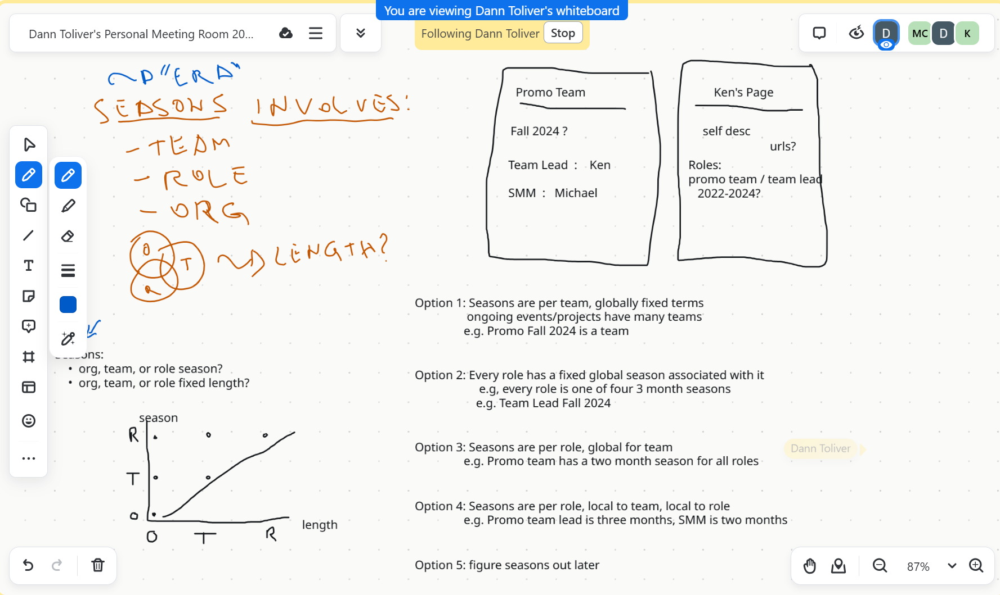
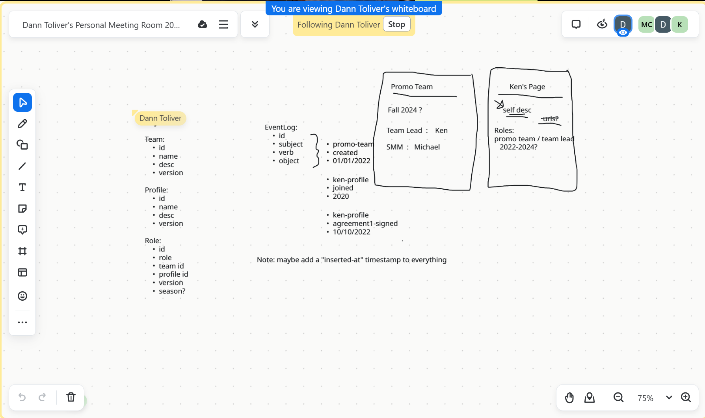

# VMS Meeting Notes - 2024-11-11

- We had a discussion about seasons, what they are and how we want to represent them
- We discussed about how we want to display data. Specifically, profile and team pages
- We discussed what is the very minimal information we want to save
	- How _flexible_ the data is?
	- How _extensible_ the data is?
	- How _constrained_ the data is?
- We arrived at 4 core objects (`Team`, `Profile`, `Role`, `EventLog`)
- All items should have two timestamps: one for when the thing happened and one for when the data/entry was created
	- The resoning is that we may retroactively add information

## Core Objects

### `Team`

- Represent a team inside Toronto JS
- E.g.: "Promo Team", "VMS Team"
- Associates with profiles via roles (A `Profile` _has_ a `Role` and _is part of_ a `Team`)

### `Profile`

- Represent a volunteer for Toronto JS
- Has roles in teams

### `Role`

- Represents the role a profile have for a team

### `EventLog`

- Is generic enough to be extended with more things in the future
- Follows a Subject, Verb, Object structure
- Described things that happened to keep a historic log
- E.g. "`Marco` (Subject) _joined_ (Verb) **VMS Team** (Object)"
- Has aditional dates to _when_ the even happened
- May have multiple entries generated for things (E.g.: Singning agreements generates one entry for each agreement)

## Screenshots from the meeting

